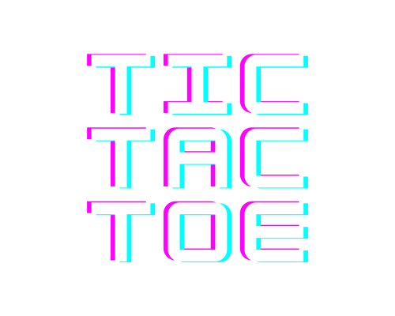

  

<h3 align="center">TIC TAC TOE</h3>

---

 Welcome to TIC TAC TOE, an adaptation of the classic game for browsers. The playing rules are the same that have always been, if you like it please don't doubt on giving a positive review, and if you have any suggestions to make to the game please do so by forking the project.

You can play it online at:  https://paullibre.github.io/TICTACTOE/
      

## 📝 Table of Contents

- [About](#about)
- [Getting Started](#getting_started)
- [Deployment](#deployment)
- [Usage](#usage)
- [Built Using](#built_using)
- [Authors](#authors)

## 🧐 About 

I made this project to demonstrate javascript, html and css capabilities.

## 🏁 Getting Started 

To use this project in local all you should do is to download all the files, and launch it from Visual Studio or any other text editor.

### Prerequisites

You don't need any prerequiste in order to use this project

## 🎈 Usage 

The game offers two modes, player vs player and plaver vs cpu, in order to use any of those you should just press de play button and a pop-up screen will appear letting you choose, you can only have a maximum of three tokens in game, when you get to the limit you will need to take one off in order to continue playing.
The computer will play randomly, it's in the process of being upgraded.

## ⛏️ Built Using 

- CSS- Design
- SASS- Design Compilation
- HTML - Structure
- JS - Functionality

## ✍️ Authors 

- [@shuii18](https://github.com/shuii18) - Idea & Initial work
